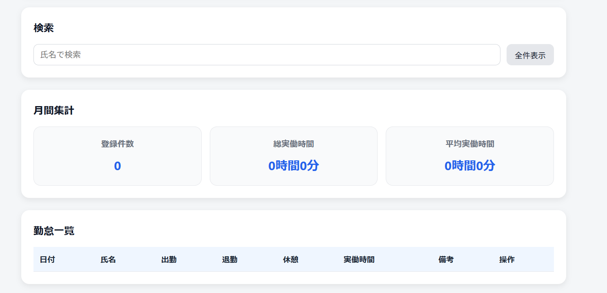

# 勤怠管理ツール

日々の勤怠記録を登録・管理できる業務改善ツールです。  
入力したデータは一覧表示・検索・集計が可能で、localStorageにより保存されます。

---

## ■ 制作背景

人事総務の業務において、勤怠データの入力・確認・集計作業が多く、  
手作業によるミスや手間を感じていました。

そこで、日々の勤怠情報を簡単に登録・管理でき、  
検索や集計まで行えるツールを作成しました。

---

## ■ 使用技術

- HTML
- CSS
- JavaScript（Vanilla）
- localStorage

---

## ■ 主な機能

- 勤怠データの登録（日時・氏名・出退勤・休憩・備考）
- 実働時間の自動計算
- 勤怠一覧表示
- データ削除機能
- 氏名による検索（リアルタイム）
- 月間集計（登録件数・総実働時間・平均時間）
- localStorageによるデータ保存

---

## ■ 工夫した点

- 入力から一覧・検索・集計まで一画面で完結するUI設計
- 実務を想定し、見やすさ・操作のしやすさを重視
- 実働時間を自動計算し、手作業の負担を軽減
- カードUI・余白設計で視認性を向上

---

## ■ 今後の改善点

- 編集機能の追加
- 日付や月ごとのフィルター機能
- CSV出力機能
- デザインの改善（レスポンシブ強化）

---

## ■ デモ

（ここにGitHub PagesのURLを貼る）

---

## ■ 画面イメージ

## ■ デモ

https://ryuunosuke-1113.github.io/attendance-tool/